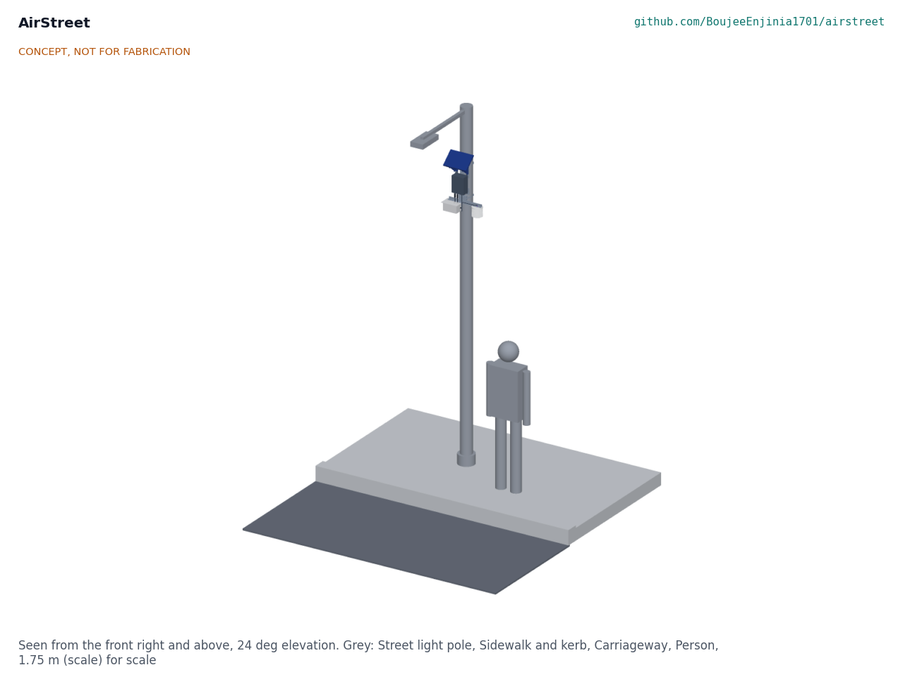
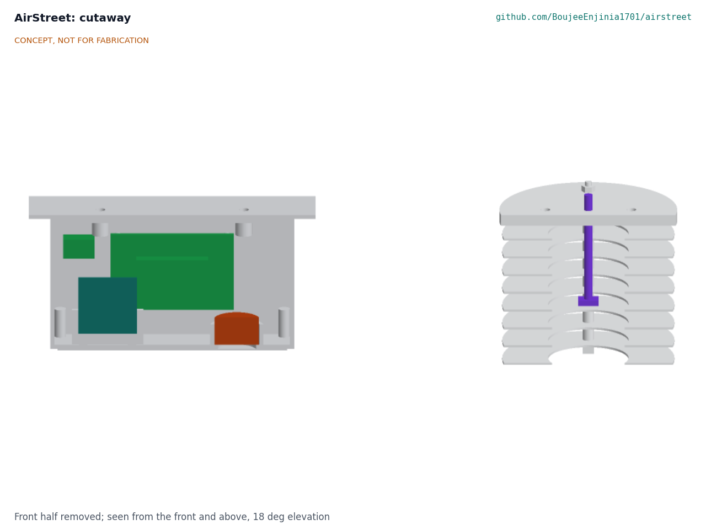
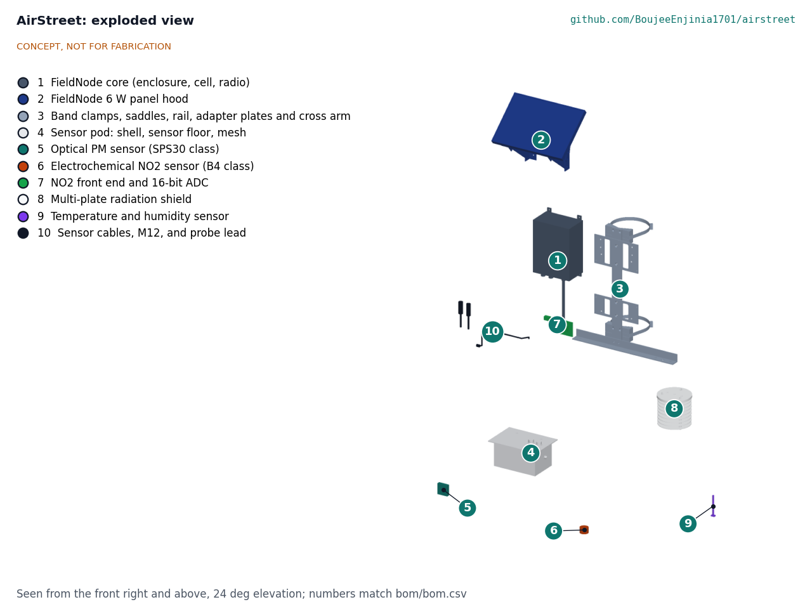
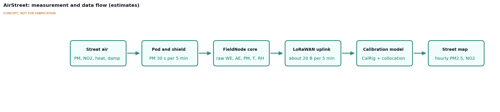

# AirStreet design precis

## Summary

AirStreet is a pole-mounted node that measures PM2.5 and NO2 at street level for neighborhood-scale pollution maps. A small sensor pod and a radiation shield hang below a FieldNode core on a street light pole, with the inlet plane 3.0 m above the sidewalk. Temperature, humidity and particle readings are checked on CalRig. CalRig does not cover NO2, so each NO2 sensor is calibrated by field collocation with a reference station before deployment and at intervals afterward. The node sends raw signals, so calibrations can be improved and reapplied later. Amish accepted the recommended design choices on 2026-09-25 ([AST-DDR-001](decisions/0001-trl2-review-decisions.md), [AST-DDR-002](decisions/0002-recommendations-accepted.md)).

The TRL 3 calculations ([AST-CAL-001](04-calcs/01-sizing.md) v0.6) confirm the power and radio budget: an 87.0 mW design sensor load with a 60 s particle run, inside FieldNode's 100 mW design allowance, 6.6 days without sun, and 0.60 % duty cycle even at SF12. On 2026-09-30 the design was made constructable ([AST-DDR-003](decisions/0003-design-for-construction.md)) and an illustrated prototype build plan was written ([AST-BLD-001](05-build-plan.md)). With the four lightening steps accepted on 2026-10-02 (a 40 x 4 mm rail, windows in the adapter plates, 1.5 mm shield plates and saddles printed at 40 % infill), the buildable node weighs 3.62 kg and presents 0.139 m² to the street, which meets its 0.15 m² area limit; with FieldNode's sun shield it weighs 3.78 kg, 0.22 kg under the 4.0 kg limit that Amish set for R13 on 2026-10-02 (it was 3.5 kg), so R13 is met on paper; the pole owner is still to confirm the load. Value-engineering target: USD 285. Estimated cost of the constructable design: USD 302.50 (USD 17.50 over the target) for the sensor head (R15). Decisions are recorded in the design decisions register ([AST-DEC-001](06-design-decisions.md)). The node costs $433.50 with the FieldNode core. Resolving NO2 at the WHO guideline of 10 µg/m³ is no longer a requirement: an annual mean carries about 4.2 µg/m³ of uncertainty, so AirStreet ranks streets and checks the EU limit, and the WHO question stays open as research.

Figure 1. AirStreet on a street light pole, with a 1.75 m person for scale (concept, not for fabrication).

## How it works

1. Street air enters the sensor pod from below, through stainless insect mesh under an overhanging drip lid. Downward-facing inlets keep rain and direct sun out.
2. An optical particle sensor draws a sample with its own fan for 60 s every 5 min and counts particles by laser scattering, giving PM1, PM2.5 and PM10. The SPS30 needs 8 to 30 s to its first reading, depending on particle count, so the 60 s run leaves at least 30 s of valid readings to average even in clean air (AST-DDR-002).
3. A four-electrode electrochemical NO2 sensor with an ozone filter faces down through a slot in the pod floor. Its working electrode (WE) responds to NO2, and its auxiliary electrode (AE) tracks the temperature-driven baseline. A potentiostat front end holds the bias continuously, and a 16-bit ADC reads both signals.
4. A temperature and humidity sensor sits inside a white multi-plate radiation shield beside the pod, so readings reflect air temperature rather than sun-heated plastic. These values drive the humidity correction for PM and the temperature correction for NO2.
5. Two short cables with M12 plugs run up to FieldNode's two sensor ports. Port A, on a switched 5 V rail, carries the PM sensor and the temperature and humidity sensor on one I2C bus and is powered only during each PM run. Port B carries the NO2 front end on a 5 V rail that stays on, because the sensor bias must be held continuously. FieldNode provides power, storage and a LoRaWAN radio, and its 6 W panel shades the enclosure.
6. Every 5 min through a private gateway (the TwinKit gateway by default), or every 15 min on The Things Network, the node sends one record of 20 bytes: raw PM values, raw WE and AE voltages, temperature, humidity, a status word, a counter and flags. It never sends images, audio or identifiers of people.
7. A server-side calibration model converts raw values to PM2.5 and NO2 concentrations. Each model is versioned and linked to the node's CalRig record and its collocation record, so any map can be traced to the calibration behind it.

Figure 2. Cutaway of the sensor pod (PM sensor, NO2 sensor and front end) and the radiation shield.

## Main components

Item numbers match the BOM ([bom/bom.csv](../bom/bom.csv)), the exploded view (Figure 3) and the parametric model `cad/src/model.py`. The general arrangement is drawing AST-DWG-001 (`cad/drawings/`).

Table 1. Main components.

| No. | Component | Key choice (decided by Amish, 2026-09-25) |
| --- | --- | --- |
| 1 | FieldNode core | Shared lab core per FND: IP65 enclosure 150 x 90 x 200 mm, LiFePO4 cell, MPPT charger, STM32WL LoRaWAN, two M12 5-pin sensor ports; the enclosure, built to FieldNode's constructable design, fixes by its four lugs to two adapter plates on the AirStreet rail, and FieldNode's back plate, V-blocks and 40 to 60 mm clamps are not used (DDR-002, DDR-003); FieldNode's sun shield is fitted at sites above 45 °C |
| 2 | FieldNode 6 W panel hood | Part of FieldNode; 40° tilt toward the street side as a sun and rain hood |
| 3 | Band clamps and mounting rail | Two 12.7 mm stainless bands cut to length, 375 mm apart, each running in a groove behind a printed 140° V-saddle that seats 80 to 200 mm poles; 40 x 4 mm aluminium rail 451 mm long; two 3 mm aluminium adapter plates with FieldNode's back plate hole pattern and lightening windows; a 30 x 30 x 3 mm cross arm that carries the pod and the shield (DDR-002, DDR-003); no drilling |
| 4 | Sensor pod | Printed ASA shell with walls, roof and 200 x 140 mm drip lid in one, 170 x 110 x 95 mm with its sensor floor, which carries both sensors and closes the pod from below behind mesh; hung under the cross arm 90 mm to one side so the FieldNode whip hangs beside it with 15 mm clearance; the pod with its sensors and front end is the service exchange unit (DDR-002) |
| 5 | Optical PM sensor | Sensirion SPS30 (D6); the maker states a lifetime of more than ten years ([Sensirion](https://sensirion.com/products/catalog/SPS30)) |
| 6 | Electrochemical NO2 sensor | Alphasense NO2-B43F class (D4): four electrodes and an ozone filter; replace about every 2 years (estimate) |
| 7 | NO2 front end and ADC | Alphasense ISB class potentiostat bought for the first units (D5), with an ADS1115 class 16-bit ADC |
| 8 | Radiation shield | Eight white 120 mm plates at 13 mm pitch on three rods with spacers, 124 mm cap screwed under the cross arm, naturally ventilated |
| 9 | Temperature and humidity sensor | Sensirion SHT45 on a probe board, hung in the shield on a 6 mm tube |
| 10 | Sensor cables | Two 0.5 m shielded cables with M12 plugs into glands in the pod roof; probe lead with an M8 plug for the pod wall |
| 11 | Fasteners and consumables | Not modeled |

Figure 3. Exploded view with BOM numbers.

## Key design choices

Amish accepted every recommendation below on 2026-09-25 (AST-DDR-001 D1 to D9 and AST-DDR-002). Purchasing, collocation and publication of data are TRL 4 and later work and are on hold.

- **Build on FieldNode.** AirStreet designs only the sensor head, its mount and the calibration route. Power, radio and enclosure fixes found in other deployments carry over. The FieldNode core is costed in FieldNode, and AirStreet's value-engineering target covers the sensor head (D1).
- **Two calibration routes, stated plainly.** CalRig checks temperature, humidity and particle response in a chamber. NO2 is calibrated by field collocation with a regulatory reference station (chemiluminescence), because field calibration corrects temperature, humidity and cross-sensitivity effects that laboratory calibration misses ([Zimmerman et al., 2018](https://amt.copernicus.org/articles/11/291/2018/)). This follows the approach of the US EPA NO2 sensor protocols, which include field evaluation alongside regulatory monitors ([US EPA](https://www.epa.gov/air-sensor-toolbox/air-sensor-performance-targets-and-testing-protocols)).
- **Collocation plan (D3).** Each node sits beside a reference station for at least 14 days before deployment, covering a range of temperature, humidity and NO2. At least one anchor node stays at the reference site permanently to track seasonal drift, and every node returns for collocation at least every 6 months. The first model is a multiple linear regression on WE, AE, temperature and humidity, with a random forest model as an option once enough data exist.
- **Send raw signals (D8).** Raw WE and AE voltages and raw PM values let the city or community reprocess data when a better model or a new collocation becomes available.
- **Four-electrode NO2 sensor with ozone filter (D4).** The auxiliary electrode helps remove the temperature-driven baseline, and the filter reduces ozone interference.
- **Duty-cycled PM sensor (D8, run length per DDR-002).** Running the particle sensor for 60 s every 5 min gives a valid reading even in clean air, keeps its average draw near 55 mW and slows fouling.
- **Reporting by network (DDR-002).** 5 min records through the private TwinKit gateway; 15 min on The Things Network, which keeps within its 30 s/day fair-use policy up to SF9.
- **Pod exchange for service (DDR-002).** The whole pod, pre-collocated at the reference site, is exchanged at the pole; sensors are never swapped at height.
- **No FieldNode back plate (DDR-002).** The FieldNode enclosure and its panel bracket fix to two adapter plates on the AirStreet rail (AST-DDR-003), saving about 0.15 kg against FieldNode's back plate. This changes the FieldNode mounting interface and needs FieldNode's agreement.
- **Hot sites (DDR-002).** FieldNode's sun shield is required at any site where ambient temperature exceeds 45 °C.
- **WHO guideline as research (DDR-002).** AirStreet ranks streets and checks the EU limit; it makes no claim about the WHO annual guideline for NO2.
- **Inlets 3.0 m above the sidewalk (D7).** This is within the 1.5 to 4 m inlet range in EU Directive 2008/50/EC ([EUR-Lex](https://eur-lex.europa.eu/legal-content/EN/TXT/HTML/?uri=CELEX:32008L0050)) and out of easy reach.
- **Open data (D9).** Calibrated hourly data, with the calibration version, are published to an open platform such as OpenAQ, subject to the partner's agreement.

## Key numbers (TRL 3)

All values come from AST-CAL-001, which lists every assumption.

Table 2. Key numbers.

| Quantity | Value | Note |
| --- | --- | --- |
| PM sensor average power | 55.0 mW typical, 65.0 mW maximum | SPS30 55 mA typical, 65 mA maximum at 5 V (datasheet), 60 s in every 300 s |
| NO2 front end and ADC | 7.5 mW | 1.5 mA at 5 V held continuously (assumed) |
| Design sensor load | 87.0 mW | Maximum SPS30 current and 1.2 margin; FieldNode allows 100 mW (design) or 115 mW (ceiling) (R9 met on paper) |
| Daily draw and autonomy | 2.33 Wh/day; 6.6 days without sun | 4.6 days at -20 °C; 7.75 Wh stored in FieldNode's worst month |
| Payload and airtime | 20 bytes every 5 min (15 min on TTN); 247 ms at SF9, 1.81 s at SF12 | 0.082 % and 0.60 % duty cycle (R10 met on paper); at 15 min, TTN's 30 s/day fair use is met up to SF9 (23.7 s/day) |
| NO2 hourly error | About 3.9 ppb MAE (7.4 µg/m³) | Budget of literature and assumed terms (R2 at risk) |
| NO2 annual uncertainty | About 4.2 µg/m³ (1σ) | Too large to resolve the 10 µg/m³ WHO guideline; R3 withdrawn and kept as a research question |
| EU limit classification | Decisive below 34.6 or above 45.4 µg/m³ | 90 % confidence against 40 µg/m³ (R4 at risk) |
| PM2.5 hourly error | Within ±5 µg/m³ or ±30 % up to 80 % RH | Outside the bound at 85 % RH and above (R1 at risk) |
| Shield radiation error | 0.42 to 0.87 K at 1 m/s | Reads up to 4.1 % RH low at 85 % RH (R5 at risk) |
| Mass on the pole | 3.62 kg | FieldNode 1.89 kg as used (no back plate), sensor head and mount 1.73 kg, with the four lightening steps (3.78 kg with the sun shield against the 4.0 kg R13 limit set on 2026-10-02; R13 met on paper, AST-DDR-003 A1) |
| Frontal area | 0.139 m² | Rasterized from the model; limit 0.15 m² (met on paper) |
| Wind at 35 m/s | 125 N, 416 N·m at the pole base | Clamp slip factor 25; the pole check is the owner's |
| Parts cost | Sensor head $302.50; $433.50 with the FieldNode core | $17.50 over the $285 value-engineering target (`budget_usd`; R15 over the target) |
| Service | About 14 min for a pod exchange | Against 15 min (R16 met on paper) |

Figure 4. Measurement and data flow.

## Safety

> **Safety:** Mounting on a street pole is work at height next to traffic. Install only with the pole owner's written permission, by trained crews using a mobile elevating work platform or a secured ladder with a second person, with traffic management as local rules require. The node adds about 125 N of wind load and about 416 N·m at the pole base in a 35 m/s gust, and up to 4.0 kg of weight; the pole owner must confirm the pole can carry it.

> **Safety:** Street light poles carry mains voltage inside. Never open the pole's access door or tap pole power; AirStreet runs only on its own solar and battery supply.

> **Safety:** The FieldNode core holds a lithium iron phosphate cell. Use a fused, protected cell, charge only within the maker's temperature limits and replace any swollen or damaged cell. FieldNode is rated for ambient temperatures up to 45 °C; hotter sites must have FieldNode's sun shield fitted (AST-DDR-002).

> **Safety:** Electrochemical gas sensors contain an acid electrolyte. Do not open, crush or heat them; dispose of them as the maker directs. Band clamp ends and cut flat bar have sharp edges; deburr them and wear gloves. Band clamps rely on their preload; installers need a torque figure before any field use.

> **Safety:** AirStreet data are indicative and are not a regulatory measurement or health advice. Maps must state the calibration version and its uncertainty.

## Open questions

- [ ] Which city, partner and reference station host the first collocation? Decided on 2026-10-02 as a rule: a city or air agency that runs a regulatory NO2 reference station at a street-level site AirStreet can mount beside, and that will share its data. First candidate to approach: the Texas Commission on Environmental Quality's Dallas-Fort Worth monitoring network, with a local university or city partner; nothing is agreed yet. The partner's country sets the radio band (US915 in North America, EU868 in Europe).
- [ ] Is the NO2 error after field calibration stable across seasons, and how large is the reference-to-street transfer bias in practice?
- [ ] How fast does air move inside the shield in low wind, and so how large is the radiation error?
- [ ] Does the SPS30 need a heated or dried inlet above 85 % RH, or is a humidity flag on the data enough?
- [ ] Will FieldNode accept its enclosure, plate clips and sun shield on AirStreet's two adapter plates in place of its back plate? (Decided in AirStreet, AST-DDR-002 and AST-DDR-003; on 2026-10-02 Amish approved sending FieldNode the request; FieldNode's agreement is outstanding.)
- [ ] Can the NO2 annual mean ever be resolved at the WHO guideline, for example with an anchor node at every site? (Research question, AST-DDR-002.)
- [ ] Is an open two-channel front end at about $25 worth designing, to restore cost margin? (On hold with TRL 4.)
- [ ] How are nodes secured against theft, and what does the pole owner require for insurance and inspection?
